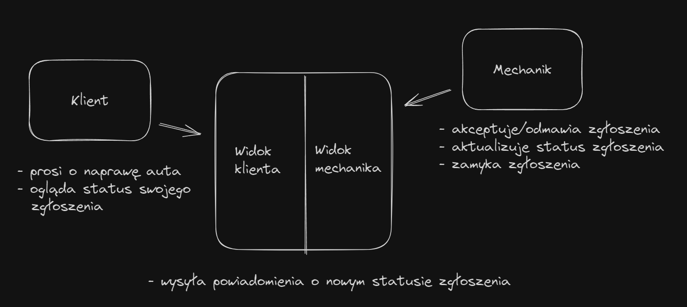

# Initial design of system functions



### How to run a project in developement mode

In first terminal run tailwind automatic css generation:

```bash
make tailwind
```

In second terminal run auto-reload on golang code:

```bash
make reload
```

And after every change in go templates run:

```bash
make templ
```

---

### Project TODO's:

- [ ] Make every form a modal
- [ ] Strictest validation possible!
